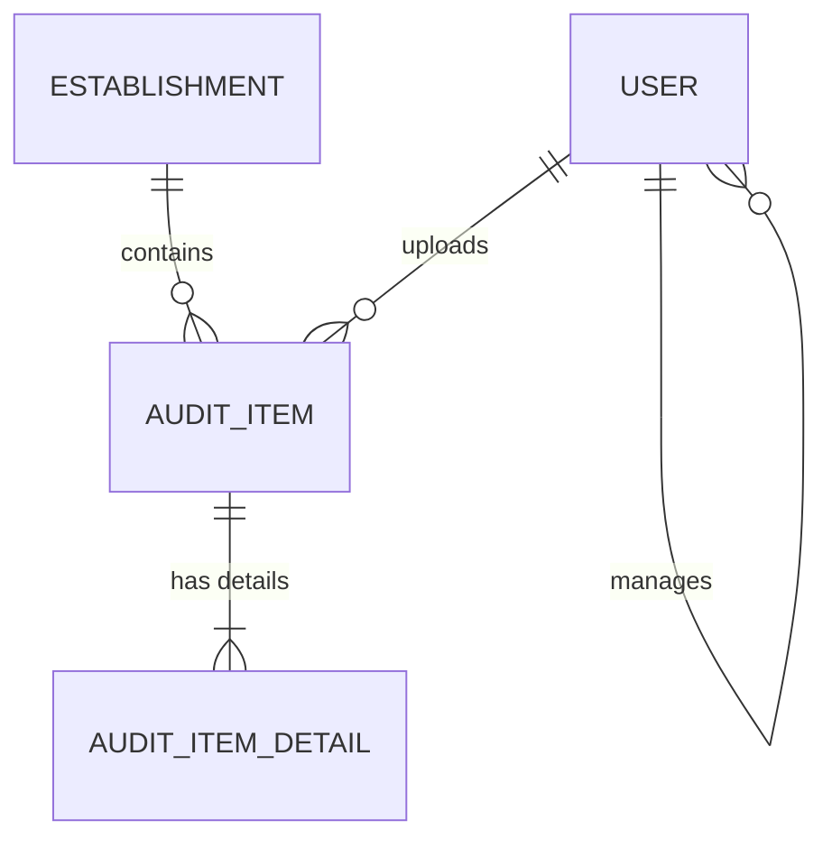

# Auditing System Design Spec

This document details the architecture and requirements for the migration and enhancement of the Petty Cash Fund (PCF) expense auditing system from Ruby on Rails to ASP.NET Core MVC (C#) using MySQL (via XAMPP).

---

## 1. Objectives & Roles

The system allows Buyers to submit purchase records (audits) by uploading receipts. The receipts are parsed using Cloud OCR. The records are then reviewed and verified by Managers and the Owner.

### Roles
* **Owner (Admin)**: Full administrative access. Can view and modify all users, view and approve/reject all audits, adjust petty cash balances.
* **Manager (Co-Admin)**: Manages a subset of Buyers. Can only view and approve/reject audits for their assigned Buyers.
* **Buyer (Staff)**: Uploads receipts, reviews OCR-parsed details, assigns them to an Establishment, and tracks their own balance/audits.

---

## 2. Database Schema (MySQL)

We use Entity Framework Core with the Pomelo MySQL provider.

### Table Definitions

#### `Users`
* `Id` (int, AutoIncrement, PK)
* `Name` (varchar(100), Not Null)
* `Email` (varchar(100), Unique, Not Null)
* `PasswordHash` (varchar(255), Not Null)
* `Role` (varchar(20), Not Null) -- Owner, Manager, Buyer
* `ManagerId` (int, Nullable, FK to `Users.Id`)
* `PcfBalance` (decimal(12,2), Default 0.00)
* `DailyStartingFloat` (decimal(12,2), Default 0.00)

#### `Establishments`
* `Id` (int, AutoIncrement, PK)
* `Name` (varchar(100), Unique, Not Null) -- e.g., Dayo, Chefs Kitchen Main Branch

#### `AuditItems`
* `Id` (int, AutoIncrement, PK)
* `BuyerId` (int, FK to `Users.Id`)
* `EstablishmentId` (int, FK to `Establishments.Id`)
* `Amount` (decimal(12,2), Not Null)
* `Description` (text, Not Null)
* `EntryDate` (date, Not Null)
* `Status` (varchar(20), Default 'Pending') -- Pending, Approved, Rejected
* `Notes` (text, Nullable)
* `ReceiptImageUrl` (varchar(255), Nullable)
* `VerifiedById` (int, Nullable, FK to `Users.Id`)
* `VerificationDate` (datetime, Nullable)

#### `AuditItemDetails`
* `Id` (int, AutoIncrement, PK)
* `AuditItemId` (int, FK to `AuditItems.Id`, Cascade Delete)
* `ItemName` (varchar(150), Not Null)
* `Quantity` (int, Default 1)
* `Price` (decimal(12,2), Not Null)
* `Total` (decimal(12,2), Not Null)

---

## 3. Receipt OCR & Upload Workflow

1. **Upload**: Buyer uploads a receipt photo (PNG/JPG/JPEG).
2. **OCR Parsing**: Server calls Azure AI Document Intelligence (`prebuilt-receipt` model).
   * Extracted fields: Transaction Date, Total Amount, and individual line items (name, quantity, unit price, total).
3. **Review**: Buyer is presented with a form pre-populated with extracted details side-by-side with the uploaded receipt image. The Buyer selects the destination Establishment and corrects any OCR errors.
4. **PCF Check & Deduction**:
   * On submit, the system verifies `Buyer.PcfBalance >= AuditItem.Amount`.
   * If valid, the amount is deducted from the Buyer's `PcfBalance`, and the `AuditItem` is created with state `Pending`.

---

## 4. Manager Verification Workflow

* **Visibility**:
  * Owners see all pending items.
  * Managers only see pending items where `Buyer.ManagerId == Manager.Id`.
* **Verification Decisions**:
  * **Approve**: Set `Status` to `Approved`. No changes are made to the wallet balance (deducted during upload).
  * **Reject**: Set `Status` to `Rejected`. The system **refunds** the `AuditItem.Amount` back to the `Buyer.PcfBalance`.

---

## 5. Filtering & Dashboard Requirements

* **Audits Dashboard Filter Options**:
  * Date range (From Date - To Date)
  * Status (Pending / Approved / Rejected)
  * Establishment (Dropdown)
  * Buyer (Dropdown - Owner sees all, Manager sees assigned)
* **Summary Stats**: Real-time display of total amount matching active filters.
